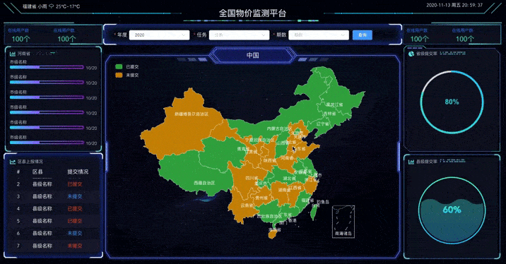

## 一、项目描述

- 一个基于 Vue、Datav、Echart 框架的 " **数据大屏项目** "，由于是从公司内部项目中剥离出来的，所以后端方面的数据请求都去除了，大屏的一些数据联动效果保留了其中一部分。
- 项目在做中国地图时最开始接入的是阿里旗下的高德地图开发，后来因为种种原因改为了百度的Echarts中国地图，并且做到了省市县的联动下钻。
- 项目部分区域使用了全局注册方式，增加了打包体积，在实际运用中请使用 **按需引入**。

友情链接：

1.  [Vue 官方文档](https://cn.vuejs.org/v2/guide/instance.html)
2.  [DataV 官方文档](http://datav.jiaminghi.com/guide/)
3.  [echarts 实例](https://echarts.apache.org/examples/zh/index.html)，[echarts API 文档](https://echarts.apache.org/zh/api.html#echarts)

## 二、主要文件介绍

| 文件                | 作用/功能                                                              |
| ------------------- | --------------------------------------------------------------------- |
| main.js             | 主目录文件，引入 Echart/DataV 等文件                                    |
| utils               | 工具函数                                              |
| views/ index.vue    | 项目主结构                                                             |
| views/其余文件       | 界面各个区域组件（按照位置来命名）                                       |
| assets              | 静态资源目录，放置 logo 与背景图片                                       |

## 三、使用介绍

### 启动项目

node -v v12.16.1

npm -v 6.13.4

需要提前安装好 `nodejs` 与 `npm`,下载项目后在项目主目录下运行 `npm/cnpm install` 拉取依赖包。安装完依赖包之后然后使用 `vue-cli` 或者直接使用命令`npm run serve`，就可以启动项目。

